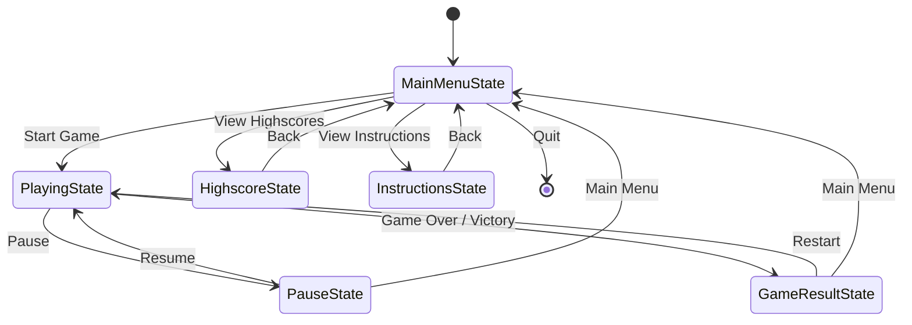
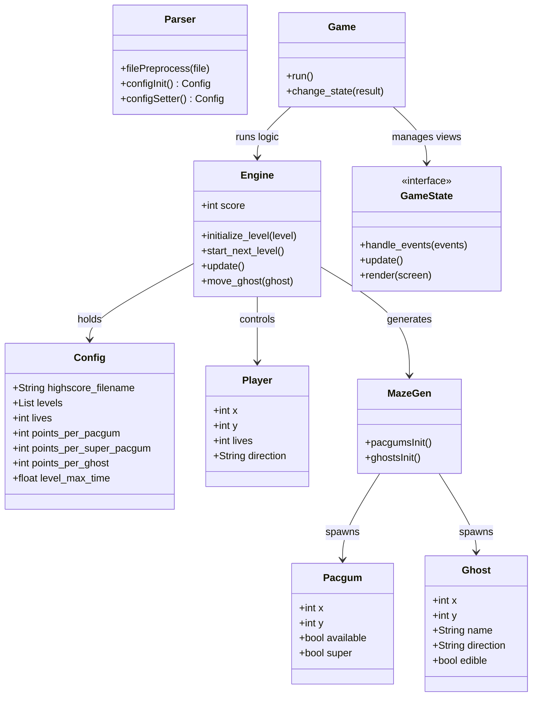

*This project has been created as part of the 42 curriculum by iazzouzi, adkhalil.*

## Description
This project is a functional and fully detailed clone of the classic arcade game **Pac-Man**, implemented in Python using the Pygame library. The goal of the project is to provide a complete, playable game where the player navigates a generated maze, eats pacgums and super-pacgums, and avoids or hunts ghosts (Blinky, Pinky, Inky, Clyde). The project features a custom robust game engine, a state-machine-based GUI, dynamic maze generation, and advanced pathfinding algorithms.

## Instructions
### Installation
To install the required dependencies (including `pygame` and the local `mazegenerator` wheel package), run the following command from the root directory:
```bash
make install
```

### Execution
To start the game using the default configuration file, run:
```bash
make run
```
You can also launch the game directly with Python by passing the configuration file:
```bash
python3 pac-man.py config.json
```

## Resources
- [Pygame Documentation](https://www.pygame.org/docs/)
- [Breadth-First Search (BFS) Algorithm](https://en.wikipedia.org/wiki/Breadth-first_search)
- [Pac-Man Ghost AI Behavior](https://pacman.live/play.html)

### AI Usage
AI tools (such as GitHub Copilot and ChatGPT) were utilized during the development of this project for:
- Brainstorming and structuring the BFS (Breadth-First Search) algorithm used for ghost pathfinding.
- Generating standard docstrings for classes and methods to improve code readability and maintainability.
- Assisting in debugging and resolving `flake8` and `mypy` linting errors to ensure code quality.

## Configuration
The game is configured via a JSON file (e.g., `config.json`). The `parser.py` module preprocesses the file to remove comments (`#` or `//`) and validates the keys and values, applying safe defaults if any value is missing or out of bounds.
- `highscore_filename` (string): The path to the JSON file where highscores are saved (default: `"highscore.json"`).
- `levels` (list of `[width, height]`): Dimensions for each level's maze (default includes 10 levels of increasing sizes).
- `lives` (integer, 1-15): The number of lives the player starts with (default: `3`).
- `points_per_pacgum` (integer, 1-1000): Points awarded for eating a regular pacgum (default: `10`).
- `points_per_super_pacgum` (integer, 1-1000): Points awarded for eating a super-pacgum (default: `50`).
- `points_per_ghost` (integer, 1-1000): Points awarded for eating an edible ghost (default: `200`).
- `level_max_time` (float, 0-1200): Time limit per level in seconds (default: `900.0` or `600.0`).

## Highscore
The highscore system persists player scores in a local JSON file (configured by `highscore_filename`).
When a game session ends, the engine reads the existing scores, appends the new player's score, sorts the entire list in descending order, and writes it back to the file. We decided to implement it this way because it is lightweight, requires no external database setup, and makes it extremely fast and easy to retrieve and display the top 10 scores within the `HighscoreState` UI.

## Maze Generation
The assigned `A-Maze-ing` (`mazegenerator`) package is used to dynamically generate the layout for each level. We created a wrapper class `MazeGen` inside `mazegen.py` that inherits from `MazeGenerator`. This wrapper handles:
- Instantiating the maze based on the level dimensions from the configuration.
- Populating the maze grid with entities: placing regular `Pacgum` instances in open corridors, overriding the four corners of the maze with `Super Pacgums`, and spawning the four ghosts (`Blinky`, `Pinky`, `Inky`, `Clyde`) at their respective start positions.

## Implementation
The game is built with a strong separation of concerns between the core logic and the graphical interface:
- **Engine**: The `Engine` class (`engine.py`) handles the main game mechanics independently of rendering. It updates entity positions, identifies target coordinates, checks collisions, tracks scoring, manages cheat modes (invincibility/freeze), and controls level progression.
- **Pathfinding**: Ghosts use a Breadth-First Search (BFS) algorithm (`algo.py`) to navigate the maze dynamically. Each ghost determines a target cell based on its unique behavior (e.g., Blinky aggressively targets Pac-Man, while Pinky anticipates his moves) and calculates the shortest path.
- **GUI State Machine**: We implemented a State Machine design pattern (`gui.py` and `gui_src/`) to manage the different screens. The state machine ensures seamless transitions and isolated event/render loops for each view.



## General Software Architecture
The software architecture follows a modular object-oriented approach:
- **`models.py`**: Contains simple data classes representing core game entities.
- **`parser.py`**: Exposes the `Parser` class responsible for sanitizing and loading the user-provided config file.
- **`engine.py`**: Houses the `Engine` class, driving the core game loop, entity interactions, and scoring logic.
- **`algo.py`**: Provides pure functions (`nmap`, `next`) for BFS pathfinding used by the ghost AI.
- **`mazegen.py`**: Houses the `MazeGen` wrapper class, adapting the raw `MazeGenerator` output.
- **`gui.py` & `gui_src/`**: Manages all Pygame initialization, sound playback, and contains the implementations of the UI State Machine (`GameState` subclasses).

### UML Class Diagram
The relationships between the core classes can be visualized as follows:



## Project Management & Team Roles
The project was collaboratively managed using Git and GitHub. We utilized branch-based workflows, committing frequently to implement distinct features and refactors and keeping the main branch updated via fast-forward merges.

### Roles
The development was split primarily into two domains focusing on core engine logic and the graphical interface:

- **iazzouzi**:
  - **Core Game Engine (`engine.py`)**: Developed the game loop, level lifecycle, mechanics, and core logic.
  - **Config Parser & Models (`parser.py`, `models.py`)**: Built the preprocessing JSON parser and core entity structures.
  - **Pathfinding & AI (`algo.py`)**: Implemented the Breadth-First Search (BFS) pathfinding algorithm for intelligent ghost movement and targeting behavior.
  - **Maze Generator Wrapper (`mazegen.py`)**: Wrapped the `A-Maze-ing` package to securely embed Pac-Man entities within generated corridors.
  - **Audio System Integration**: Implemented the Pygame sound effects (e.g., eating pacgums, eating ghosts, victory/fail tunes, sync across states).

- **adkhalil**:
  - **GUI State Machine (`gui.py`, `gui_src/`)**: Designed and implemented the robust UI State Machine (MainMenu, Playing, GameOver, Pause, etc.).
  - **Graphics & Rendering**: Implemented the Pygame loops, HUD, fonts, and logic for rendering the player, ghosts, pacgums, and dynamically drawing the maze.
  - **Player Input & Animations**: Handled real-time input syncing for the player, alongside death and movement animations.
  - **Data Persistence**: Integrated and managed the Highscore state UI and caching system.
